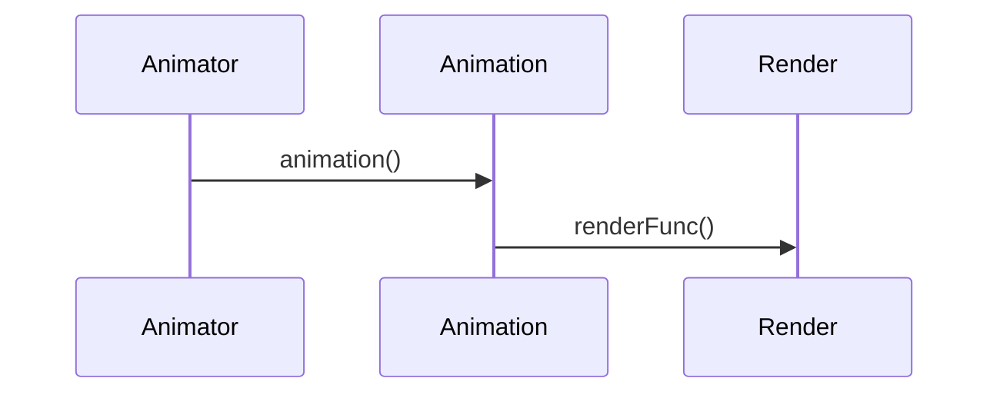

# 3D Canvas Animation

This is a simple library for creating 3D animations in the browser using canvas.

## Installation

```bash
npm install @sschepis/canvas-animator
```

## Usage

```typescript
import { Animator, Bounds, Vector3 } from '@sschepis/canvas-animator'

const bounds = new Bounds(new Vector3(-10, -10, -10), new Vector3(10, 10, 10))
const animation = () => {
    return (x: number, y: number, z: number) => {
        return x * y * z
    }
}
const renderFunc = (context: CanvasRenderingContext2D, x: number, y: number, z: number, value: number, time: number) => {
    context.fillStyle = 'black'
    context.fillRect(x, y, z, value)
    return false
}
const animator = new Animator('canvas', bounds, animation, renderFunc)
```
## Sequence diagram



## API

### Animator

The animator class is the main class for creating animations. It takes the following parameters:

- `canvas`: The id of the canvas element to render to
- `bounds`: The bounds of the animation
- `animation`: A function that returns an animation function
- `renderFunc`: A function that renders a single frame of the animation
- `randomCoords`: Whether to iterate over the animation in a random order

### Bounds

The bounds class is used to define the bounds of the animation. It takes the following parameters:

- `min`: The minimum coordinate of the animation
- `max`: The maximum coordinate of the animation

### Vector3

The vector3 class is used to define a 3D vector. It takes the following parameters:

- `x`: The x coordinate of the vector
- `y`: The y coordinate of the vector
- `z`: The z coordinate of the vector

### animationFunc

The animation function is a function that takes the following parameters:

- `x`: The x coordinate of the animation
- `y`: The y coordinate of the animation
- `z`: The z coordinate of the animation

### renderFunc

The render function is a function that takes the following parameters:

- `context`: The canvas context to render to
- `x`: The x coordinate of the animation
- `y`: The y coordinate of the animation
- `z`: The z coordinate of the animation
- `value`: The value returned by the animation function
- `time`: The time of the animation

### animationStartFunc

The animation start function is a function that returns an animation function.

## License

[MIT](https://choosealicense.com/licenses/mit/)