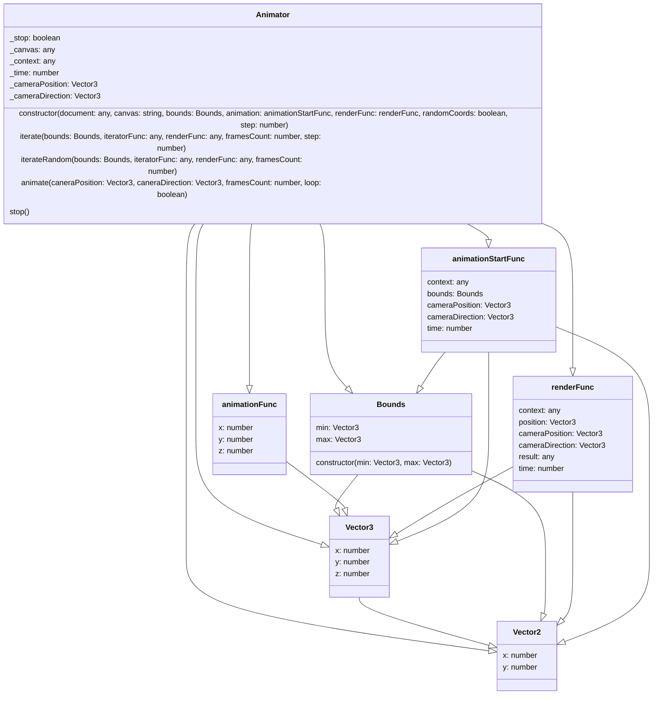
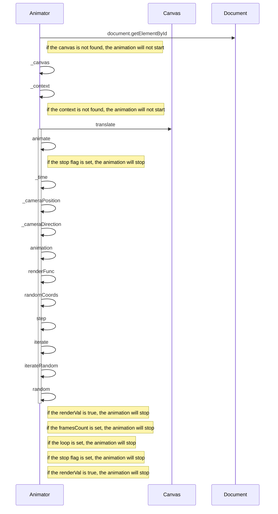

# Canvas Animator

A small library for creating 3D animations in the browser using the canvas element.

## Install

```bash
npm install @sschepis/canvas-animator
```
## Usage

```typescript
import {
  Vector3,
  Vector2,
  Animator,
  Bounds,
  animationFunc,
  renderFunc,
  animationStartFunc
} from "./animator";

const bounds = new Bounds(new Vector3(-200, -200, -200), new Vector3(200, 200, 200));

const animation: animationStartFunc = () => {
  const animations: animationFunc[] = [];
  const animation1: animationFunc = (x, y, z) => {
    return Math.sin(x / 100) * Math.sin(y / 100) * Math.sin(z / 100) * 100;
  };
  animations.push(animation1);
  return animations;
};

const render: renderFunc = (context, position, camera, direction, value, time) => {
  const render = false;
  const breakLoop = false;
  const cameraPosition = camera;
  const cameraDirection = direction;
  const cameraDistance = cameraPosition.distance(position);
  const cameraAngle = cameraDirection.angle(position);
  if (cameraDistance < value) {
    const x = position.x - cameraPosition.x;
    const y = position.y - cameraPosition.y;
    const z = position.z - cameraPosition.z;
    const x2 = x * Math.cos(cameraAngle.x) - z * Math.sin(cameraAngle.x);
    const z2 = x * Math.sin(cameraAngle.x) + z * Math.cos(cameraAngle.x);
    const y2 = y * Math.cos(cameraAngle.y) - z2 * Math.sin(cameraAngle.y);
    const z3 = y * Math.sin(cameraAngle.y) + z2 * Math.cos(cameraAngle.y);
    const x3 = x2 * Math.cos(cameraAngle.z) - y2 * Math.sin(cameraAngle.z);
    const y3 = x2 * Math.sin(cameraAngle.z) + y2 * Math.cos(cameraAngle.z);
    const x4 = x3 + cameraPosition.x;
    const y4 = y3 + cameraPosition.y;
    const z4 = z3 + cameraPosition.z;
    const distance = Math.sqrt(x4 * x4 + y4 * y4 + z4 * z4);
    const angle = Math.atan2(y4, x4);
    const size = 1 / distance;
    context.beginPath();
    context.arc(
      Math.cos(angle) * distance,
      Math.sin(angle) * distance,
      size,
      0,
      2 * Math.PI
    );
    context.fillStyle = `rgba(255,255,255,${size})`;
    context.fill();
  }
  return breakLoop;
};

const animator = new Animator(
  bounds,
  animation,
  render,
  document.getElementById("canvas") as HTMLCanvasElement
);

animator.animate(new Vector3(0, 0, 0), new Vector3(0, 0, 0), 1000, true);
```
## Diagrams

### Class Diagram

(omitting Vector2 and Vector3's methods)


### Sequence Diagram





## API

### Vector3
...

### Vector2
...

### Bounds

```typescript
class Bounds {
  min: Vector3;
  max: Vector3;
  constructor(min: Vector3, max: Vector3);
}
```

### animationFunc

```typescript
type animationFunc = (x: number, y: number, z: number) => number;
```

### renderFunc

```typescript
type renderFunc = (
  context: CanvasRenderingContext2D,
  position: Vector3,
  camera: Vector3,
  direction: Vector3,
  value: number,
  time: number
) => boolean;

```

### animationStartFunc

```typescript
type animationStartFunc = () => animationFunc[];
```

### Animator

```typescript
class Animator {

  constructor(
    bounds: Bounds,
    animation: animationStartFunc,
    renderFunc: renderFunc,
    context: CanvasRenderingContext2D
  );

  animate(
    caneraPosition: Vector3,
    caneraDirection: Vector3,
    framesCount: number = 0,
    loop: boolean = true
  ): void;

  stop(): void;
}
```

## License

MIT