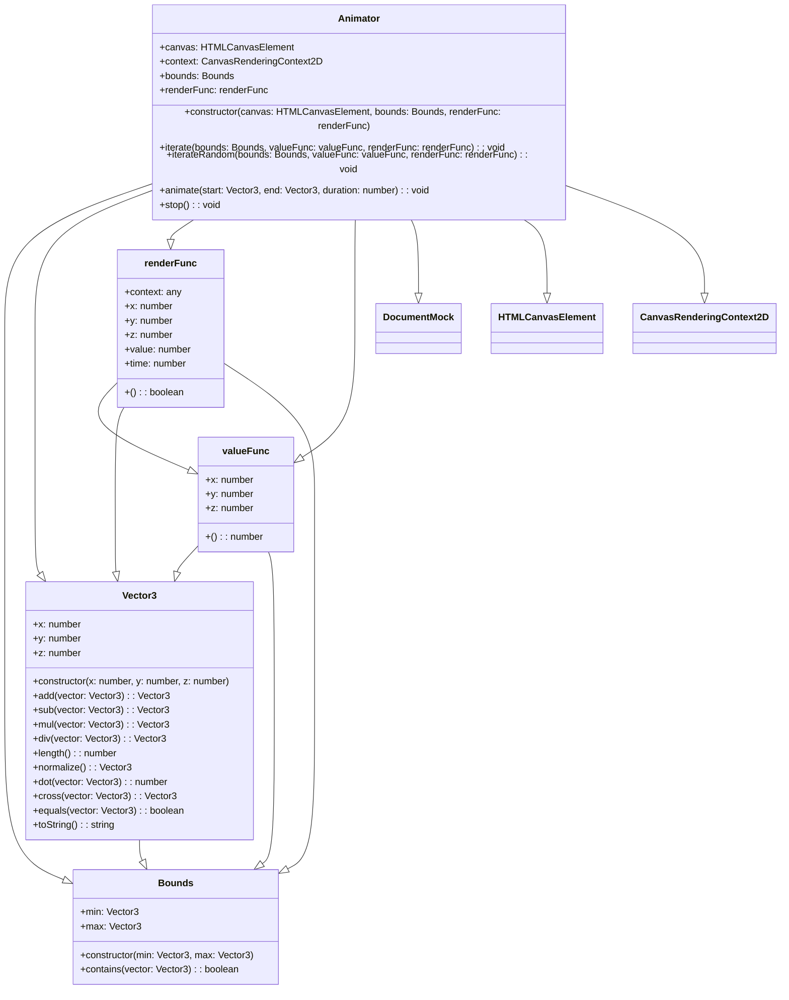
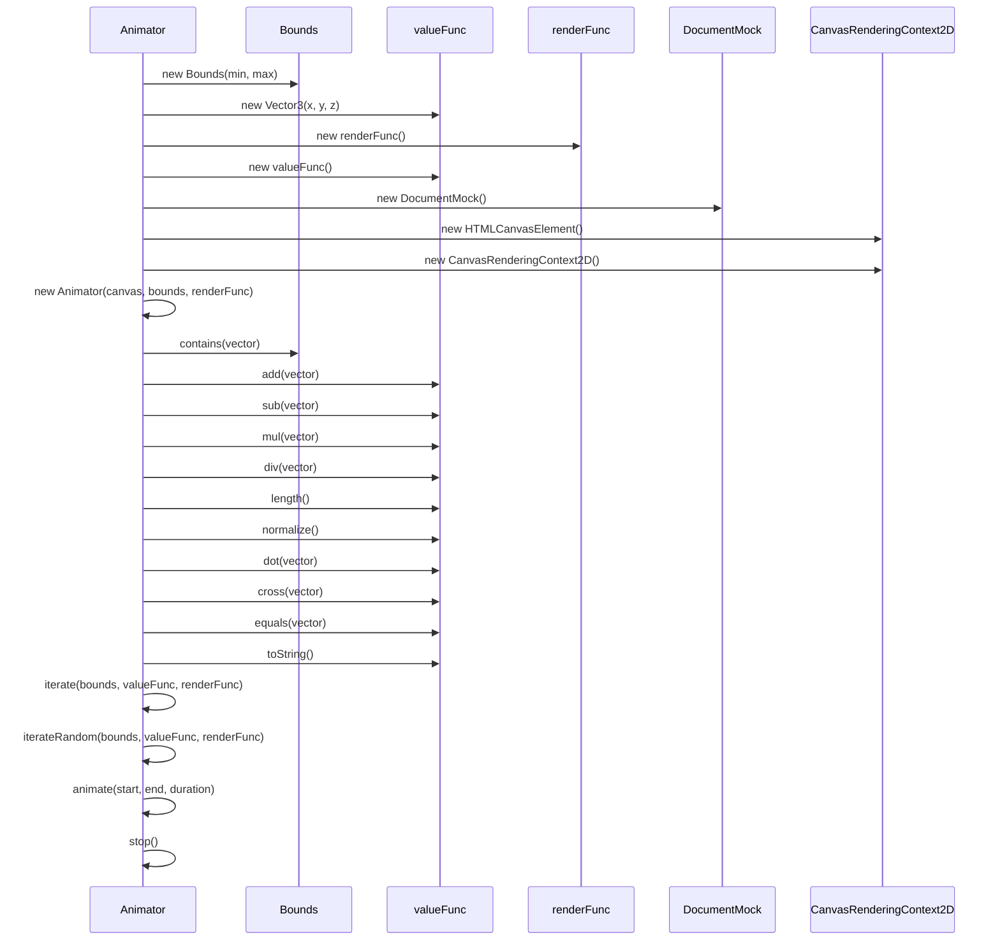

# Canvas Animator

A small library for creating 3D animations in the browser using the canvas element.

## Install

```bash
npm install 3d-canvas
```

## Usage

```typescript
import { Animator, animationFunc, renderFunc } from '3d-canvas'

const canvas: string = 'canvas'
const bounds = new Bounds(
    new Vector3(-100, -100, -100), 
    new Vector3(100, 100, 100)
)
const animation: animationFunc = (x: number, y: number, z: number) => {
    return x + y + z
}
const renderFunc: renderFunc = (context: CanvasRenderingContext2D, x: number, y: number, z: number, value: number, time: number) => {
    context.fillStyle = '#000'
    context.fillRect(x, y, 1, 1)
    return false
}
const animator = new Animator(
    document, 
    canvas, 
    bounds, 
    animation, 
    renderFunc
)
animator.animate(new Vector3(0, 0, 0), new Vector3(0, 0, 0))
```

## Diagrams

### Class Diagram


### Sequence Diagram



## API

### Animation

An animation is a function that returns a value for a given set of coordinates. The function signature is `(x: number, y: number, z: number) => number`

### Render

A render function is a function that is called for each point in the animation. The function signature is `(context: CanvasRenderingContext2D, x: number, y: number, z: number, value: number, time: number) => boolean`

The render function takes the following parameters:

- `context` - The canvas context
- `x` - The x coordinate of the current point
- `y` - The y coordinate of the current point
- `z` - The z coordinate of the current point
- `value` - The value of the point as returned by the animation function
- `time` - The current time of the animation

The render function should return a boolean value indicating if the animation should stop.

### Animator

The animator class is used to create and run the animation. It takes the following parameters:

- `document` - The document object
- `canvas` - The id of the canvas element
- `bounds` - The bounds of the animation
- `animation` - The animation function
- `renderFunc` - The render function

#### animate

The animate method starts the animation. It takes the following parameters:

- `caneraPosition` - The position of the camera
- `caneraDirection` - The direction of the camera
- `framesCount` - The number of frames to render per animation frame. If this value is not set, all frames will be rendered per animation frame.

#### stop

The stop method stops the animation.

### Bounds

The bounds class is used to define the bounds of the animation. It takes the following parameters:

- `min` - The minimum bounds
- `max` - The maximum bounds

#### min

The min property is a Vector3 object that defines the minimum bounds.

#### max

The max property is a Vector3 object that defines the maximum bounds.

### Vector3

The vector3 class is used to define a point in 3D space. It takes the following parameters:

- `x` - The x coordinate of the point
- `y` - The y coordinate of the point
- `z` - The z coordinate of the point

### Vector3.distance

The distance method returns the distance between two points.

### Vector3.rotate

The rotate method rotates a point around another point.

### Vector3.normalize

The normalize method normalizes the vector.

### Vector3.add

The add method adds two vectors.

### Vector3.subtract

The subtract method subtracts two vectors.

### Vector3.multiply

The multiply method multiplies a vector by a scalar.

### Vector3.divide

The divide method divides a vector by a scalar.

### Vector3.dot

The dot method returns the dot product of two vectors.

### Vector3.cross

The cross method returns the cross product of two vectors.

### Vector3.equals

The equals method returns a boolean indicating if two vectors are equal.

### Vector3.fromArray

The fromArray method returns a vector from an array.

### Vector3.toArray

The toArray method returns an array from a vector.

## License

MIT
